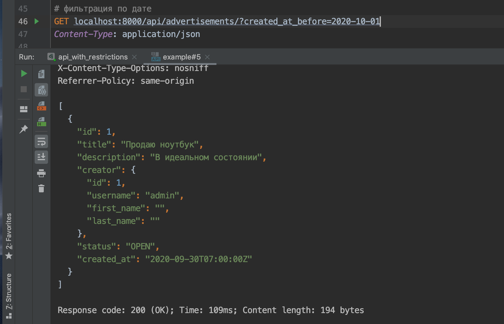

# HW 'Backend для приложения с объявлениями'

## Задание:

Необходимо реализовать бэкенд для мобильного приложения с объявлениями. Объявления можно создавать и просматривать. Есть возможность фильтровать объявления по дате и статусу.

Создавать могут только авторизованные пользователи. Для просмотра объявлений авторизация не нужна.

У объявления есть статусы: `OPEN`, `CLOSED`. Необходимо валидировать, что у пользователя не больше 10 открытых объявлений.

Обновлять и удалять объявление может только его автор.

Чтобы боты и злоумышленники не нагружали нашу систему, добавьте лимиты на запросы:

- для неавторизованных пользователей: 10 запросов в минуту;
- для авторизованных пользователей: 20 запросов в минуту.

### Описание задачи:

- Используйте `DateFromToRangeFilter` для фильтрации по дате https://django-filter.readthedocs.io/en/stable/ref/filters.html#datefromtorangefilter.

Пример работы:

- В настройках подключено приложение `rest_framework.authtoken` и сконфигурирован `DEFAULT_AUTHENTICATION_CLASSES`. Для того, чтобы завести токен для пользователя, проделайте следующие шаги:

  - создайте пользователя через админку,
  - также через админку заведите ему токен,
  - этот токен используйте в запросах, передавая его в заголовках.

- Так как интерфейс BrowserableAPI в DRF не позволяет передавать заголовки с токеном, используйте Postman или HTTP-клиент VSCode.

Примеры:

Успешный запрос:

Неправильный токен:

- Для переопределения доступов для отдельных методов `ViewSet` используется метод `get_permissions`. Он добавлен в заготовку, следует с ним ознакомиться и посмотреть с помощью breakpoint'ов в какой момент DRF его вызывает.

- Валидацию удаления чужого объявления следует делать:

  - либо внутри метода `destroy` https://www.django-rest-framework.org/api-guide/viewsets/#viewset-actions — это чуть проще;
  - либо определяя дополнительный класс-наследник `BasePermission`, дополнительно добавляя его в список `get_permissions` https://www.django-rest-framework.org/api-guide/permissions/#examples — это правильнее, и этот класс можно переиспользовать для других методов.

    Любой вариант допустим в рамках этого задания.

- С примерами запросов к API вы можете ознакомиться в [файле requests-examples.http](./requests-examples.http).

## Дополнительные задания (не обязательные к выполнению):

### Права для админов

- Реализуйте функциональность для админов. Админы могут менять и удалять любые объявления.

### Избранные объявления

- Добавить возможность добавлять объявления в избранное. Автор объявления не может добавить своё объявление в избранное. Должна быть возможность фильтрации по избранным объявлениям. Например, пользователь хочет посмотреть все объявления, которые он добавил в избранное.

- Для того, чтобы добавить дополнительный метод с урлом во ViewSet, вам может пригодиться декоратор `action` из `DRF`.

### Добавить статус `DRAFT`

- Добавьте статус `DRAFT` — черновик. Пока объявление в черновике, оно показывается только автору объявления, другим пользователям оно недоступно.

## Реализация дополнительного задания:

+ `Права для админов`: 
  - админы могут менять и удалять объявления, не помеченные как "Черновик" ("draft" = "TRUE").
+ `Избранные объявления`:
  - неавторизированные пользователи не могут добавлять объявления "В избранное".
  - свои объявления "В избранное" добавить нельзя.
  - добавить объявления в избранное можно через метод get: `GET {{baseUrl}}/advertisements/<id>/favorite`, где **id** - это **id объявления**.
  - удалить объявление из избранного можно повторным вызовом этого же метода с указанием id того объявления, которое нужно удалить.
  - просмотреть избранное можно при помощи запроса: `GET {{baseUrl}}/advertisements/favorites`
+ `Добавить статус DRAFT`:
  - поле DRAFT в модели Advertisement принимает значение TRUE (True) или FALSE (False). Реализовано не через BoolranField, а через TextField --> TextChoices, как и поле "status". 
  - по умолчанию поле "draft" = "FALSE".
  - администратор может перевести объявление в разряд черновиков ("draft" = "TRUE"), после чего объявление будет видеть только его создатель (пока он не присвоит "draft" значение "FALSE").

